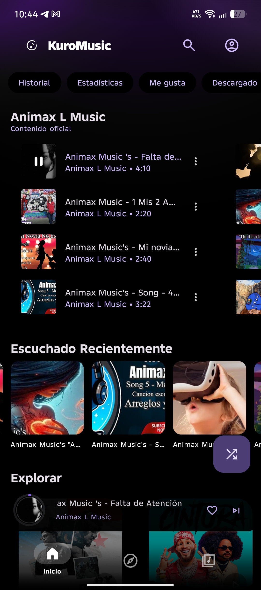
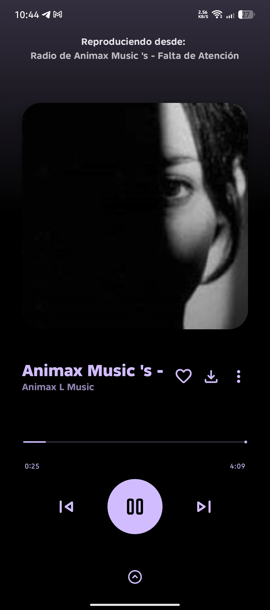
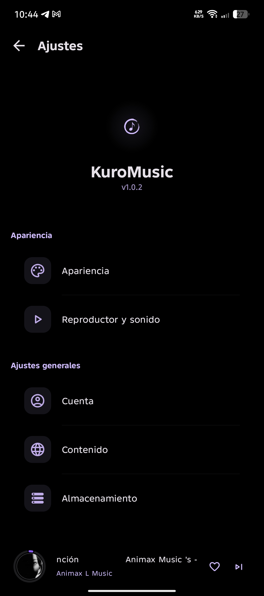

# KuroMusic

<div align="center">
  
  
### Cliente Avanzado Music Pro con Material Design 3 para Android (Negro/Morado)

  [](https://android.com)
  [](https://kotlinlang.org)
  [](LICENSE)
  [](https://github.com/KuroMusic/KuroMusic/actions)
  [](https://github.com/KuroMusic/KuroMusic/releases)
  
  [](https://t.me/KiritoAPT2)

</div>

---

## 📖 About

**KuroMusic** es un cliente open-source de nueva generación para Music Pro en Android. Diseñado meticulosamente con **Material Design 3**, ofrece una interfaz inmersiva en tonos **Negro Puro (#000000)** y **Morado Vibrante (#7B1FA2)**.

Nuestro objetivo es proporcionar una experiencia musical premium, sin anuncios, con privacidad total y funcionalidades avanzadas que no encontrarás en clientes estándar. KuroMusic no está afiliado a Google LLC.

---

## 🏗️ Architecture

KuroMusic sigue los principios de **Clean Architecture** y **MVVM (Model-View-ViewModel)**, asegurando un código modular, escalable y fácil de mantener.

* **UI Layer**: Jetpack Compose con Material 3.
* **Domain Layer**: Casos de uso y lógica de negocio pura.
* **Data Layer**: Repositorio único, fuentes de datos locales (Room) y remotas (InnerTune).

---

## 🛠️ Tech Stack & Dependencies

El proyecto utiliza las últimas tecnologías de desarrollo Android moderno.

| Category | Technology | Description |
| :--- | :--- | :--- |
| **Language** |  | Lenguaje principal del proyecto. |
| **UI** |  | Toolkit moderno para UI nativa. |
| **Multimedia** |  | Reproducción de audio robusta y eficiente. |
| **Database** |  | Persistencia de datos local robusta. |
| **Injection** |  | Inyección de dependencias estándar. |
| **Image Loading** |  | Carga de imágenes rápida y ligera. |

---

## ✨ Key Features

### 🎵 Core Experience

* **Ad-Free**: Disfruta de tu música sin interrupciones ni anuncios.
* **Background Playback**: Reproducción continua en segundo plano y pantalla bloqueada.
* **Offline Mode**: Descarga tus canciones favoritas para escuchar sin conexión.
* **High Quality Audio**: Soporte para streaming de alta fidelidad.

### 🎨 Visual & Customization

* **Dynamic Theming**: La interfaz se adapta a los colores de la carátula del álbum.
* **Pure Black Mode**: Tema optimizado para pantallas OLED.
* **Lyrics en Tiempo Real**: Sigue la letra de tus canciones sincronizadas perfectamente.

### 🚀 Advanced Tools

* **Silence Skip**: Salta automáticamente los silencios en las canciones.
* **Volume Normalization**: Audio consistente en todas las pistas.
* **Android Auto**: Compatible para una experiencia segura mientras conduces.

## 📱 Galería Visual

<p align="center">
  
  
  
</p>

---

## 📥 Installation

| Requirement | Details |
| :--- | :--- |
| **OS** | Android 6.0 (Marshmallow) o superior |
| **Architecture** | Universal (ARMv7, ARM64, x86) |
| **Space** | ~20 MB de espacio libre |

### 🚀 Quick Start

1. Descarga el último **APK** desde la sección de [Releases](https://github.com/KuroMusic/KuroMusic/releases).
2. Habilita "Instalar de orígenes desconocidos" en tu dispositivo Android si es necesario.
3. Instala el APK y disfruta de la música.

```bash
# Para desarrolladores: Clonar y compilar
git clone https://github.com/KuroMusic/KuroMusic.git
cd KuroMusic
./gradlew assembleRelease
```

---

## 🛡️ Security & Privacy

Nos tomamos la seguridad en serio. Consulta nuestra [Política de Seguridad](SECURITY.md) para más detalles.

> [!NOTE]
> Al ser una aplicación de código abierto no firmada por una gran entidad, Play Protect puede mostrar una advertencia. El código es 100% auditable y seguro.

---

## 🤝 Community & Support

Únete a nuestra creciente comunidad.

* 💬 **Telegram**: [t.me/KiritoAPT2](https://t.me/KiritoAPT2) - Soporte directo y chat.
* 🐛 **Issues**: Reporta bugs o sugiere mejoras en [GitHub Issues](https://github.com/KuroMusic/KuroMusic/issues).
* 📜 **Code of Conduct**: Revisa nuestro [Código de Conducta](CODE_OF_CONDUCT.md).

---

## 👥 Credits

| User | Role |
| :--- | :--- |
| **KiritoAPT2** | Lead Developer 👨‍💻 |
| **TeamAnimax** | Agradecimiento de apoyo � |

---

## 📜 License

Este proyecto está licenciado bajo la **GNU General Public License v3.0**. Consulta el archivo [LICENSE](LICENSE) para más detalles.

Copyright © 2026 KuroMusic
